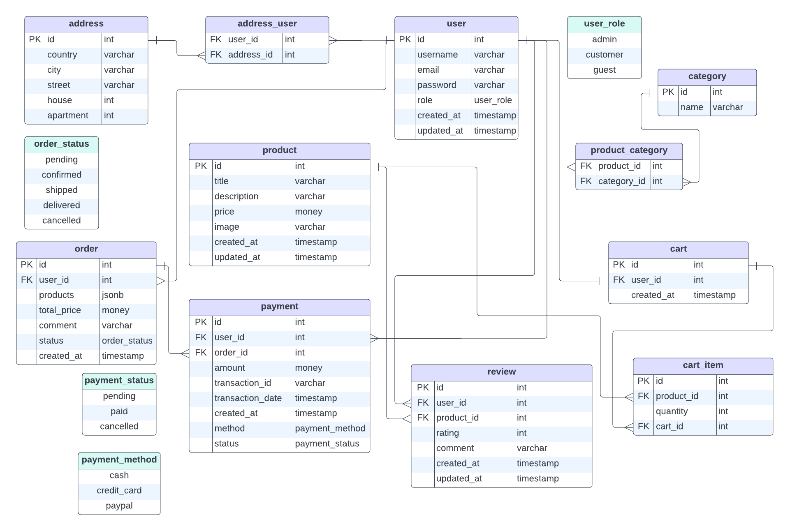

# Data Modeling

## Content

- [Technology](#technology)
- [Entity Relationship Diagram](#entity-relationship-diagram)
- [Tables](#tables)
  - [Address](#1-address)
  - [User](#2-user)
  - [Address_user](#3-addressuser)
  - [Product](#4-product)
  - [Category](#5-category)
  - [Product_category](#6-productcategory)
  - [Order](#7-order)
  - [Payment](#8-payment)
  - [Review](#9-review)
  - [Cart](#10-cart)
  - [Cart item](#11-cartitem)
- [Types](#types--enumeration-)
  - [Order status](#1-order-status)
  - [Payment status](#2-payment-status)
  - [Payment method](#3-payment-method)
  - [User role](#4-user-role)
- [Relationships](#relationships)

-----

## Technology

* Database - PostgreSQL

## Entity Relationship Diagram

## Tables

### 1. Address
Address information for delivering.

| Key | Column Name | Data Type | Description                    |
|-----|-------------|-----------|--------------------------------|
| PK  | id          | int       | Primary key for Address record |
|     | country     | varchar   | Name of the country            |
|     | city        | varchar   | Name of the city               |
|     | street      | varchar   | Name of the street             |
|     | house       | int       | Number of the house            |
|     | apartment   | int       | Number of the apartment        |

### 2. User
Information about users.

| Key | Column Name | Data Type | Description                                    |
|-----|-------------|-----------|------------------------------------------------|
| PK  | id          | int       | Primary key for User record                    |
|     | username    | varchar   | User's name                                    |
|     | email       | varchar   | User's email                                   |
|     | password    | varchar   | User's hashed password                         |
|     | role        | user_role | User's role                                    |
|     | created_at  | timestamp | Date and time when the record was created      |
|     | updated_at  | timestamp | Date and time when the record was last updated |

### 3. Address_user
Intermediate table for connection table user and address.

| Key | Column Name | Data Type | Description                                     |
|-----|-------------|-----------|-------------------------------------------------|
| FK  | user_id     | int       | User record id                                  |
| FK  | address_id  | int       | Address record id                               |

### 4. Product
Information about products.

| Key | Column Name | Data Type | Description                                    |
|-----|-------------|-----------|------------------------------------------------|
| PK  | id          | int       | Primary key for Product record                 |
|     | title       | varchar   | Product's title                                |
|     | description | varchar   | Product's description                          |
|     | price       | money     | Product's price                                |
|     | image       | varchar   | Product's image                                |
|     | created_at  | timestamp | Date and time when the record was created      |
|     | updated_at  | timestamp | Date and time when the record was last updated |

### 5. Category
Information about categories.

| Key | Column Name | Data Type | Description                     |
|-----|-------------|-----------|---------------------------------|
| PK  | id          | int       | Primary key for Category record |
|     | name        | varchar   | Category's title                |

### 6. Product_category
Intermediate table for connection table product and category.

| Key | Column Name | Data Type | Description        |
|-----|-------------|-----------|--------------------|
| FK  | product_id  | int       | Product record id  |
| FK  | category_id | int       | Category record id |

### 7. Order
Information about orders.

| Key | Column Name | Data Type    | Description                               |
|-----|-------------|--------------|-------------------------------------------|
| PK  | id          | int          | Primary key for Order record              |
| FK  | user_id     | int          | User's id                                 |
|     | products    | jsonb        | List of products in Order record          |
|     | total_price | money        | Total price of the order                  |
|     | comment     | varchar      | Comment to the order                      |
|     | status      | order_status | Status of the order                       |
|     | created_at  | timestamp    | Date and time when the record was created |

### 8. Payment
Information about payments.

| Key | Column Name      | Data Type      | Description                                 |
|-----|------------------|----------------|---------------------------------------------|
| PK  | id               | int            | Primary key for Payment record              |
| FK  | user_id          | int            | User's id                                   |
| FK  | order_id         | int            | Order's id                                  |
|     | amount           | money          | Amount of money in the payment              |
|     | transaction_id   | varchar        | Transaction's id                            |
|     | transaction_date | timestamp      | Date and time when the transaction was made |
|     | created_at       | timestamp      | Date and time when the record was created   |
|     | method           | payment_method | Method of the payment                       |
|     | status           | payment_status | Status of the payment                       |

### 9. Review
Information about reviews.

| Key | Column Name | Data Type | Description                                    |
|-----|-------------|-----------|------------------------------------------------|
| PK  | id          | int       | Primary key for Review record                  |
| FK  | user_id     | int       | User's id                                      |
| FK  | product_id  | int       | Product's id                                   |
|     | rating      | int       | Rating of the product in the review            |
|     | comment     | varchar   | Comment in the review                          |
|     | created_at  | timestamp | Date and time when the record was created      |
|     | updated_at  | timestamp | Date and time when the record was last updated |

### 10. Cart
Information about carts.

| Key | Column Name | Data Type | Description                               |
|-----|-------------|-----------|-------------------------------------------|
| PK  | id          | int       | Primary key for Cart record               |
| FK  | user_id     | varchar   | User's id                                 |
|     | created_at  | timestamp | Date and time when the record was created |

### 11. Cart_item
Information about one product in the cart.

| Key | Column Name | Data Type | Description                                     |
|-----|-------------|-----------|-------------------------------------------------|
| PK  | id          | int       | Primary key for Cart_item record                |
| FK  | product_id  | int       | Product's id                                    |
|     | quantity    | int       | Quantity of the product in cart                 |
| FK  | cart_id     | int       | Product's price                                 |

## Types (Enumeration)

### 1. Order status

| order_status |
|--------------|
| pending      |
| confirmed    |
| shipped      |
| delivered    |
| cancelled    |

### 2. Payment status

| payment_status |
|----------------|
| pending        |
| paid           |
| cancelled      |

### 3. Payment method

| payment_method |
|----------------|
| cash           |
| credit_card    |
| paypal         |

### 4. User role

| user_role |
|-----------|
| admin     |
| customer  |
| guest     |

## Relationships

The relationships between the tables are:

- Multiple addresses can have multiple users associated with them (many-to-many) at the table `addresses_users` with fields `user_id` and `address_id`.
- Multiple products can have multiple categories associated with them (many-to-many) at the table `products-categories` with fields `product_id` and `category_id`.
- One User can have only one Cart associated with them (one-to-one) at `Cart(user_id)`.
- Cart can have multiple Cart_items associated with them (one-to-many) at `Cart_item(cart_id)`.
- Cart can have multiple Products associated with them (one-to-many) at `Cart_item(product_id)`.
- User can have multiple Orders associated with them (one-to-many) at `Order(user_id)`.
- One Payment can have only one Order associated with them (one-to-one) at `Order(payment_id)`.
- User can have multiple Payments associated with them (one-to-many) at `Paymnet(user_id)`.
- User can have multiple Reviews associated with them (one-to-many) at `Review(user_id)`.
- Product can have multiple Reviews associated with them (one-to-many) at `Review(product_id)`.
______